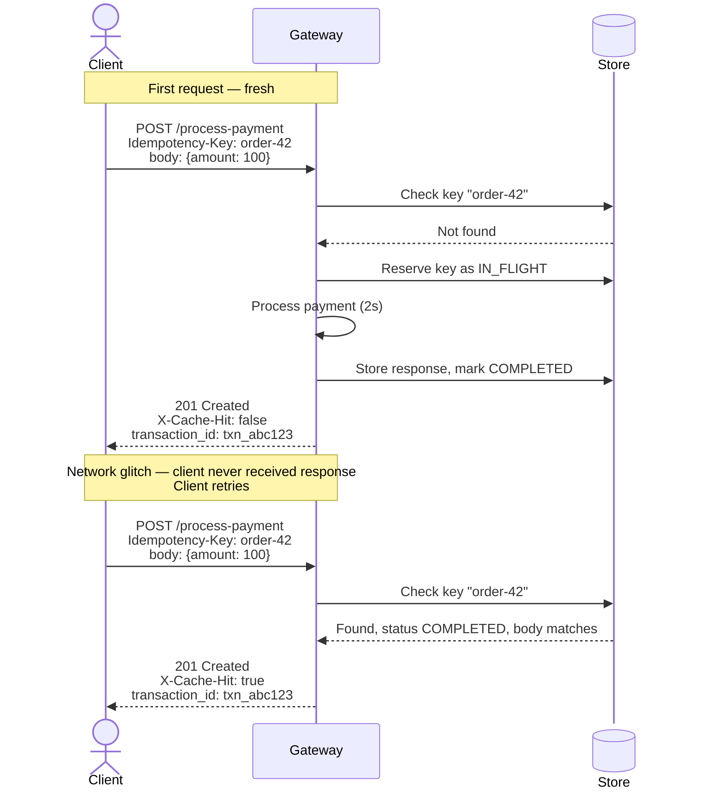
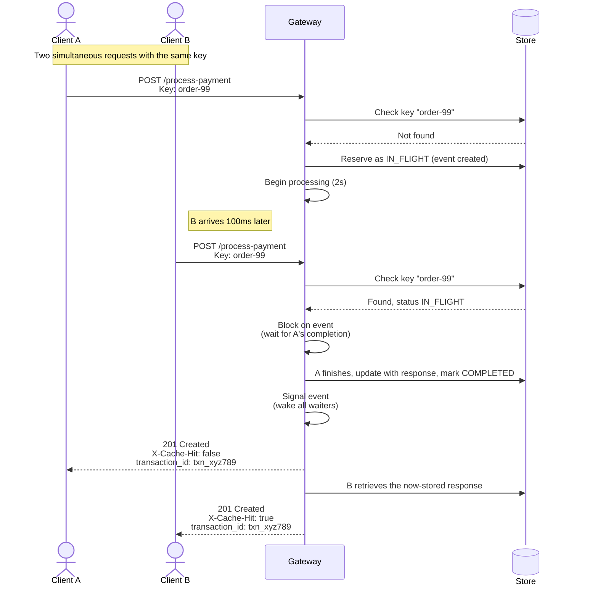

# Idempotency-Gateway

> **Note:** This README is being written incrementally during development.
> The original assignment brief is preserved below for reference and will
> be replaced before submission.

## Architecture (in progress)

The decision flow the server follows for each incoming request:

## Sequence Diagrams

### Scenario 1: Happy path with a retry

### Scenario 2: Concurrent duplicate (in-flight collision)    

---
## Original Assignment Brief
(everything that was already in the README continues here unchanged)

# Idempotency-Gateway (The "Pay-Once" Protocol)
This challenge is designed to test your ability to bridge Computer Science fundamentals with Modern Backend Engineering.

## 1. Business Context
> **Client:** *FinSafe Transactions Ltd.* (A fast-growing Payment Processor).

### The Problem
FinSafe's clients (e-commerce shops) occasionally experience network timeouts. When this happens, their servers automatically retry sending payment requests. Recently, this has led to a critical issue: **Double Charging**.

If a customer clicks "Pay," the request is sent, but the network lags. The client retries the request. FinSafe processes *both* requests, charging the customer twice. This is causing customer churn and regulatory headaches.

### The Solution
FinSafe needs you to build an **Idempotency Layer**. This is a middleware service (or API) that ensures no matter how many times a client sends the same request, the payment is processed **exactly once**.

---

## 2. Technical Objective
Build a RESTful API that mimics a payment processing backend. It must check for a unique `Idempotency-Key` in the HTTP headers.

* **First Request:** Process the payment and save the response.
* **Duplicate Request:** Detect the existing key and return the *saved* response immediately, without processing the payment again.

---

## 3. Getting Started

1.  **Fork this Repository:** Do not clone it directly. Create a fork to your own GitHub account.
2.  **Environment:** You may use **Node.js, Python, Java or Go, etc.**. You may use any database or in-memory store (Redis, SQLite, or a simple native Map/Dictionary variable).
3.  **Submission:** Your final submission will be a link to your forked repository containing the source code and documentation.

---

## 4. The Architecture Diagram 
**Task:** Before you write any code, you must design the logic flow.
**Deliverable:** A **Sequence Diagram** or **Flowchart** included in your README.

---

## 5. User Stories & Acceptance Criteria

### User Story 1: The First Transaction (Happy Path)
**As a** client system (e.g., an online store),  
**I want to** send a payment request with a unique ID,  
**So that** my transaction is processed successfully.

**Acceptance Criteria:**
- [ ] The API accepts a `POST` request to endpoint `/process-payment`.
- [ ] The request header must contain `Idempotency-Key: <some-unique-string>`.
- [ ] The request body accepts a JSON object (e.g., `{"amount": 100, "currency": "GHS"}`).
- [ ] The server simulates processing (e.g., a 2-second delay) and returns a `200 OK` or `201 Created` response.
- [ ] The response body should include a status message: `"Charged 100 GHS"`.

### User Story 2: The Duplicate Attempt (Idempotency Logic)
**As a** client system,  
**I want to** safely retry a request if I don't hear back,  
**So that** I don't accidentally double-charge the user.

**Acceptance Criteria:**
- [ ] If the client sends a second `POST` request with the **same** `Idempotency-Key` and payload:
    - [ ] The server must **NOT** run the processing logic again (no 2-second delay).
    - [ ] The server must return the **exact same** response body and status code as the first successful request.
    - [ ] The server returns a header `X-Cache-Hit: true` to indicate this was a replayed response.

### User Story 3: Different Request, Same Key (Fraud/Error Check)
**As a** security officer,  
**I want to** reject requests that reuse keys for different payments,  
**So that** we maintain data integrity.

**Acceptance Criteria:**
- [ ] If a request arrives with an existing `Idempotency-Key` but a **different** request body (e.g., changing amount from 100 to 500):
    - [ ] The server must return a `422 Unprocessable Entity` or `409 Conflict` error.
    - [ ] The error message should state: `"Idempotency key already used for a different request body."`

---

## 6. Bonus User Story (The "In-Flight" Check)
**As a** system architect,  
**I want to** handle cases where two identical requests arrive at the exact same time,  
**So that** we don't succumb to race conditions.

**Scenario:** Request A arrives. While Request A is still "processing" (during the 2-second delay), Request B (same key) arrives.

**Acceptance Criteria:**
- [ ] Request B should not start a new process.
- [ ] Request B should not return `409 Conflict`.
- [ ] Request B should wait (block) until Request A finishes, and then return the result of Request A.

---

## 7. The "Developer's Choice" Challenge
We believe great engineers are also product thinkers.

**Task:** Identify **one** additional feature or safety mechanism that would make this system better for a real-world Fintech company.
1.  **Implement it.**
2.  **Document it:** Explain *why* you added it in your README.

---

## 8. Documentation Requirements
Your final `README.md` must replace these instructions. It must cover:

1.  **Architecture Diagram**
2.  **Setup Instructions**
3.  **API Documentation** 
4.  **Design Decisions** 
5.  **The Developer's Choice:** Description of the extra feature you added.

---
Submit your repo link via the [online](https://forms.office.com/e/rGKtfeZCsH) form.

---
## 🛑 Pre-Submission Checklist
**WARNING:** Before you submit your solution, you **MUST** pass every item on this list.
If you miss any of these critical steps, your submission will be **automatically rejected** and you will **NOT** be invited to an interview.

### 1. 📂 Repository & Code
- [ ] **Public Access:** Is your GitHub repository set to **Public**? (We cannot review private repos).
- [ ] **Clean Code:** Did you remove unnecessary files (like `node_modules`, `.env` with real keys, or `.DS_Store`)?
- [ ] **Run Check:** if we clone your repo and run `npm start` (or equivalent), does the server start immediately without crashing?

### 2. 📄 Documentation (Crucial)
- [ ] **Architecture Diagram:** Did you include a visual Diagram (Flowchart or Sequence Diagram) in the README?
- [ ] **README Swap:** Did you **DELETE** the original instructions (the problem brief) from this file and replace it with your own documentation?
- [ ] **API Docs:** Is there a clear list of Endpoints and Example Requests in the README?

### 3. 🧹 Git Hygiene
- [ ] **Commit History:** Does your repo have multiple commits with meaningful messages? (A single "Initial Commit" is a red flag).

---
**Ready?**
If you checked all the boxes above, submit your repository link in the application form. Good luck! 🚀
