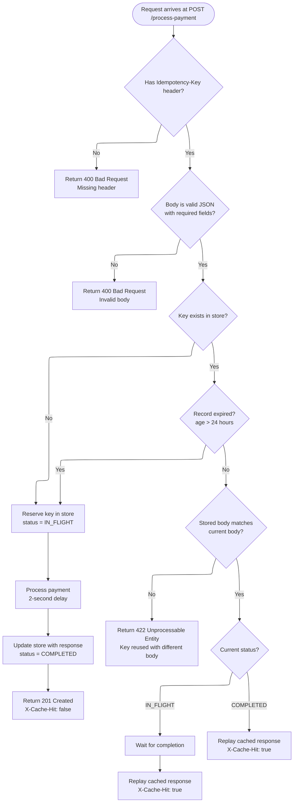
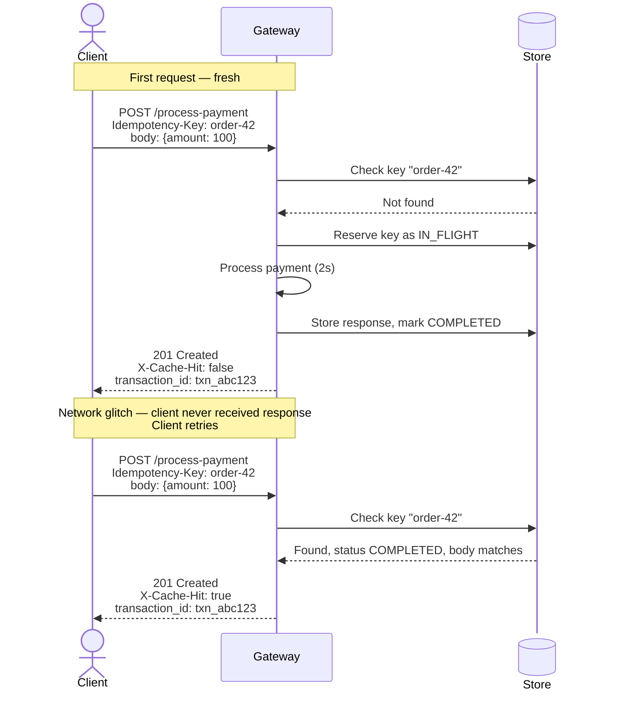
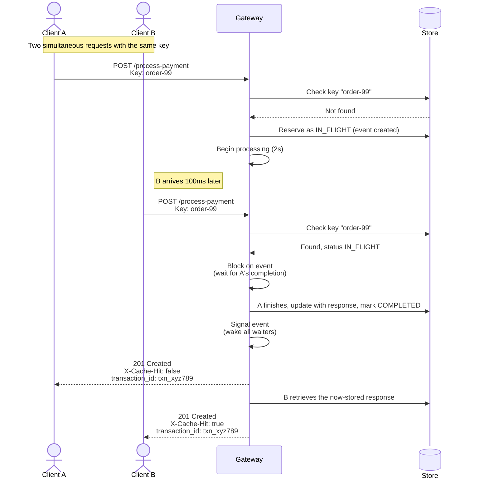

# Idempotency-Gateway: Implementation for FinSafe Transactions Ltd.

A small HTTP service that guarantees a payment is processed exactly once, even when clients retry requests over unreliable networks. Built for the AmaliTech practical capstone challenge.

The service accepts payment requests at `POST /process-payment`. Each request carries an `Idempotency-Key` header chosen by the client. If a request with the same key arrives more than once, the service returns the original response instead of processing the payment again. If two requests with the same key arrive concurrently, only one is processed and the others wait for its result. If the same key is used with a different body, the request is rejected as a contract violation.

## Features

- **Idempotent payment processing.** Same `Idempotency-Key` returns the same response on retry, never charges twice.
- **Conflict detection.** Reusing a key with a different body returns `422 Unprocessable Entity`.
- **Single-flight concurrency.** Simultaneous duplicate requests block on the original and replay its result; verified with a 25-thread concurrency test.
- **24-hour TTL on idempotency keys.** Bounds memory growth and caps the replay-attack window.
- **Structured audit logging.** Every routing decision (`NEW_REQUEST`, `REPLAY_CACHED`, `CONFLICT_422`, `WAIT_FOR_INFLIGHT`, `EXPIRED_PURGED`) is logged with timestamp, key, and client IP.
- **`X-Cache-Hit` response header.** Signals whether the response was freshly computed or replayed from cache.

## Contents

- [Overview](#idempotency-gateway)
- [Features](#features)
- [Setup](#setup)
- [Project Structure](#project-structure)
- [API](#api)
- [Architecture](#architecture)
- [Design Decisions](#design-decisions)
- [Developer's Choice: TTL and Audit Logging](#developers-choice-24-hour-ttl-and-structured-audit-logging)
- [Bonus User Story: In-Flight Race Condition](#bonus-user-story-the-in-flight-race-condition)
- [Testing](#testing)
- [Future Improvements](#future-improvements)
- [AI Tool Usage](#ai-tool-usage)
- [Known Limitations](#known-limitations)
- [License](#license)

## Setup

Requirements: Python 3.10 or later, and pip.

```bash
git clone https://github.com/dem0saic/Idempotency-Gateway.git
cd Idempotency-Gateway
python -m venv venv
venv\Scripts\Activate.ps1     # On macOS or Linux: source venv/bin/activate
pip install -r requirements.txt
python app.py
```

The server starts on `http://127.0.0.1:5000`. The startup log will print `Running on http://127.0.0.1:5000`.

## Project Structure

```
Idempotency-Gateway/
├── app.py              # Flask application: endpoint, store, lock, audit logging
├── race_test.py        # Concurrency test: fires 25 simultaneous requests
├── requirements.txt    # Python dependencies (Flask, requests)
├── README.md           # This file
├── LICENSE             # License inherited from the template repository
└── .gitignore          # Files excluded from version control
```

The entire application is in `app.py` (around 160 lines). I kept it in one file because the project is small enough that splitting it would create import boundaries between code that only talks to each other. For a larger system I would extract the audit logger, the store, and the route handler into separate modules.

## API

### `POST /process-payment`

Process a payment, with idempotency.

**Headers**

| Header | Required | Notes |
|---|---|---|
| `Content-Type` | yes | Must be `application/json` |
| `Idempotency-Key` | yes | A non-empty string unique to the logical payment |

**Body**

```json
{"amount": 100, "currency": "GHS"}
```

**Responses**

| Status | Meaning | Notable headers |
|---|---|---|
| `201 Created` | Payment processed (fresh) or cached response replayed | `X-Cache-Hit: false` on fresh; `X-Cache-Hit: true` on replay |
| `400 Bad Request` | Missing `Idempotency-Key` header, or body is missing/malformed/missing required fields | — |
| `422 Unprocessable Entity` | Same idempotency key reused with a different body | — |

**Fresh request example**

```bash
curl -X POST http://127.0.0.1:5000/process-payment \
  -H "Content-Type: application/json" \
  -H "Idempotency-Key: order-2026-001" \
  -d '{"amount": 100, "currency": "GHS"}'
```

After approximately two seconds:

```json
{"status": "Charged 100 GHS", "transaction_id": "txn_a1b2c3d4e5f6"}
```

**Duplicate request**

Re-send the same `curl` command. The response returns immediately, with the same `transaction_id`, and the `X-Cache-Hit: true` header is set.

**Conflict**

Re-send with the same key but a different body (`{"amount": 999, "currency": "GHS"}`). The server returns `422` with:

```json
{"error": "Idempotency key already used for a different request body"}
```

## Architecture

The diagrams below describe the decision logic and two important interaction scenarios.



## Sequence Diagrams

### Scenario 1: Happy path with a retry


### Scenario 2: Concurrent duplicate (in-flight collision)    


## Design Decisions

**In-memory dictionary as the store.** I used a plain Python dictionary rather than Redis or SQLite. The trade-off is that data is lost when the server restarts. For production, the dictionary would be replaced by Redis or a similar key-value store; the surrounding code is structured so that swap is mostly a one-line change.

**SHA-256 of canonical JSON for body fingerprinting.** Two semantically identical bodies can serialise to different strings if their keys are in different orders. Comparing the raw text would produce false conflicts. Sorting the keys before hashing makes the fingerprint stable regardless of the client's JSON library.

**Lock-and-Event for single-flight concurrency.** The store is protected by a `threading.Lock` so that check-and-reserve happens atomically. Each record carries a `threading.Event` so that duplicate requests arriving while the original is still processing can wait for it, then replay the result. The lock protects access to shared state; the event coordinates timing between threads. They solve different problems and work together.

**Processing happens outside the lock.** The two-second simulated processing is intentionally not inside the locked region. Holding the lock during processing would serialise the entire server — requests for *different* keys would block each other unnecessarily. By releasing the lock during processing, the system handles many keys in parallel while still preventing duplicates within a single key.

**Lazy TTL expiry.** Records are checked for expiry at lookup time rather than swept by a background thread. This avoids introducing a second thread that would need its own concurrency reasoning. The trade-off is that records for keys that are never queried again sit in memory until process exit; for production scale this would be replaced or supplemented by a periodic sweep.

## Developer's Choice: 24-hour TTL and structured audit logging

The capstone asked for one feature that would make the service more suitable for real-world fintech. I added two complementary ones that share a single motivation: production hardening.

**24-hour TTL on idempotency keys.** Records are treated as expired once their age exceeds 24 hours. This bounds the in-memory store's growth so it cannot leak forever. It also limits the window in which an intercepted idempotency key could be used to replay an old request. The 24-hour figure matches Stripe's published default for idempotency keys.

**Structured audit logging.** Every decision the server makes — `NEW_REQUEST`, `REPLAY_CACHED`, `CONFLICT_422`, `WAIT_FOR_INFLIGHT`, `EXPIRED_PURGED` — is written as a single structured log line containing the timestamp, decision, key, and client IP. Fintech systems operating under PCI-DSS and similar regimes require that every state-changing request be traceable for forensic review. Logging the decision rather than just the request makes that traceability cheap and consistent.

In production, audit logs would be written to a dedicated sink — a separate file, syslog, or a managed service — with stricter retention and access-control than application logs. Writing them to stdout in this project is a deliberate simplification for a single-process capstone.

## Bonus User Story: the in-flight race condition

The bonus story asks what happens when a duplicate request arrives during the two-second processing window of the original. A naïve implementation, where the check-and-reserve are separate steps, has a race condition: two requests can both read the empty store, both decide the request is fresh, and both process the payment, charging the customer twice.

The fix has two parts. First, the check-and-reserve happens inside a `with store_lock:` block, so the two operations are atomic with respect to other threads. Second, when a duplicate request finds the record still marked `IN_FLIGHT`, it does not error and does not return a stale empty response; it captures the record's `threading.Event` and waits on it outside the lock. The owner thread, after finishing its processing and writing the response, calls `event.set()` to wake all waiters. The waiters then re-acquire the lock briefly, read the now-complete response, and replay it.

The test script `race_test.py` fires 25 simultaneous requests at the same key and verifies that exactly one transaction ID is produced. With the lock and event in place, this test reliably passes.

## Testing

A concurrency test is included as `race_test.py`. With the server running, in a separate terminal:

```bash
python race_test.py
```

The script sends 25 simultaneous requests with the same idempotency key, then prints each thread's result and a `PASS`/`FAIL` verdict. Expected output: all 25 responses share one `transaction_id`, exactly one carries `X-Cache-Hit: false` (the owner), and all complete in approximately two seconds.

## Future Improvements

Several enhancements would make this service production-ready beyond what the capstone scope required. The in-memory store would be replaced by Redis so that idempotency records survive process restarts and can be shared across multiple service instances. A background sweep task would complement the current lazy TTL expiry to prevent unused records from sitting in memory. Audit logs would be routed to a dedicated sink with appropriate retention rather than being mixed into stdout. The 10-second wait timeout for in-flight requests would become configurable rather than hardcoded. Authentication and rate limiting would sit either in this service or in a gateway layer in front of it. None of these are blocking issues for the capstone; they are the natural roadmap for taking the service from prototype to production.

## AI Tool Usage

I used Claude (Anthropic's AI assistant) as a study partner throughout the build. Claude explained concepts I had not seen before (idempotency as a client-server contract, single-flight, the difference between what a lock guarantees and what an event coordinates) and walked me through the design before I wrote each chunk of code. I typed every line of code in `app.py` and `race_test.py` myself, debugged my own errors, and tested the behaviour at each stage.

## Known Limitations

The in-memory store is process-local; restarting the server clears all idempotency records. There is no authentication on the endpoint; in a real deployment the service would sit behind an authenticated gateway. The 10-second timeout on in-flight waits is hardcoded; in production it would be configurable.

## License

Released under [CC0 1.0 Universal](https://creativecommons.org/publicdomain/zero/1.0/), inherited from the AmaliTech template repository. See the `LICENSE` file for full text.